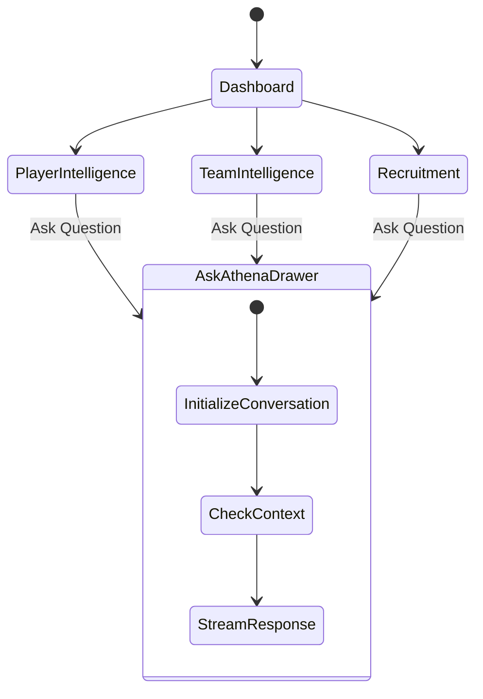

# Application Flow

```mermaid
stateDiagram-v2
    [*] --> Dashboard
    
    Dashboard --> PlayerIntelligence
    Dashboard --> TeamIntelligence
    Dashboard --> Recruitment
    
    state AskAthenaDrawer {
        [*] --> InitializeConversation
        InitializeConversation --> CheckContext
        CheckContext --> StreamResponse
    }
    
    PlayerIntelligence --> AskAthenaDrawer: Ask Question
    TeamIntelligence --> AskAthenaDrawer: Ask Question
    Recruitment --> AskAthenaDrawer: Ask Question
```
