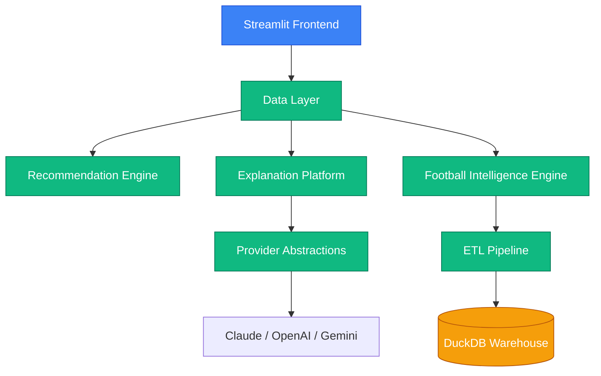

# Overall Architecture

```mermaid
graph TD
    UI[Streamlit Frontend] --> DL[Data Layer]
    
    DL --> REC[Recommendation Engine]
    DL --> EXPL[Explanation Platform]
    DL --> FIE[Football Intelligence Engine]
    
    EXPL --> PRV[Provider Abstractions]
    PRV --> Claude[Claude / OpenAI / Gemini]
    
    FIE --> ETL[ETL Pipeline]
    ETL --> DWH[(DuckDB Warehouse)]
    
    classDef frontend fill:#3b82f6,stroke:#1d4ed8,color:white
    classDef backend fill:#10b981,stroke:#047857,color:white
    classDef db fill:#f59e0b,stroke:#b45309,color:white
    
    class UI frontend
    class DL,REC,EXPL,FIE,ETL,PRV backend
    class DWH db
```
