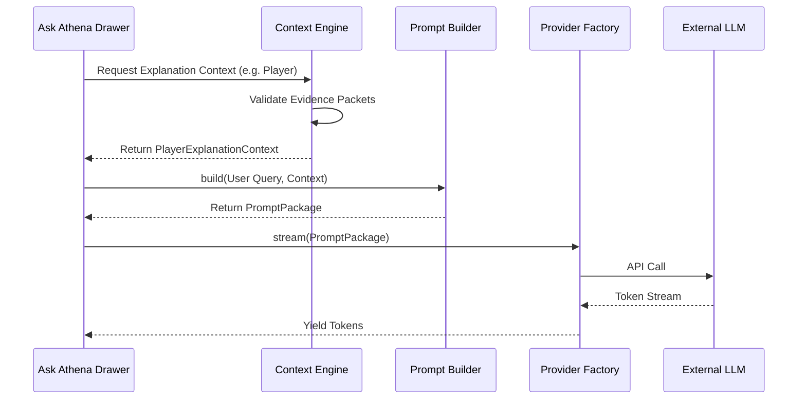

# AI Explanation Pipeline

```mermaid
sequenceDiagram
    participant UI as Ask Athena Drawer
    participant ENG as Context Engine
    participant PB as Prompt Builder
    participant PRV as Provider Factory
    participant LLM as External LLM

    UI->>ENG: Request Explanation Context (e.g. Player)
    ENG->>ENG: Validate Evidence Packets
    ENG-->>UI: Return PlayerExplanationContext
    UI->>PB: build(User Query, Context)
    PB-->>UI: Return PromptPackage
    UI->>PRV: stream(PromptPackage)
    PRV->>LLM: API Call
    LLM-->>PRV: Token Stream
    PRV-->>UI: Yield Tokens
```
