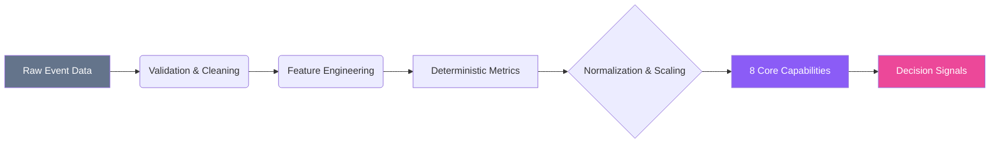

# Intelligence Pipeline

```mermaid
flowchart LR
    A[Raw Event Data] --> B(Validation & Cleaning)
    B --> C(Feature Engineering)
    C --> D[Deterministic Metrics]
    D --> E{Normalization & Scaling}
    E --> F[8 Core Capabilities]
    F --> G[Decision Signals]
    
    style A fill:#64748b,color:white
    style F fill:#8b5cf6,color:white
    style G fill:#ec4899,color:white
```
